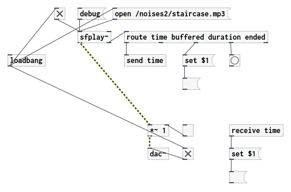

# Cord

## statement

Cord is a patcher system for the browser, utilising Scala.js and the Web Audio API. 
It is (C)opyright 2015–2020 by Hanns Holger Rutz. All rights reserved. Cord is released under 
the [GNU Lesser General Public License](https://raw.github.com/Sciss/Cord/main/LICENSE) v2.1+ and comes 
with absolutely no warranties. To contact the author, send an e-mail to `contact at sciss.de`.

This project is in early stage, so not much to see here yet.

## requirements / installation

Cord builds using sbt with the scala-js plugin. To compile: `sbt fastOptJS`. Then open `index-fastopt.html` in 
a browser. Cord has been tested with Firefox and Chromium.

## contributing

Please see the file [CONTRIBUTING.md](CONTRIBUTING.md)

